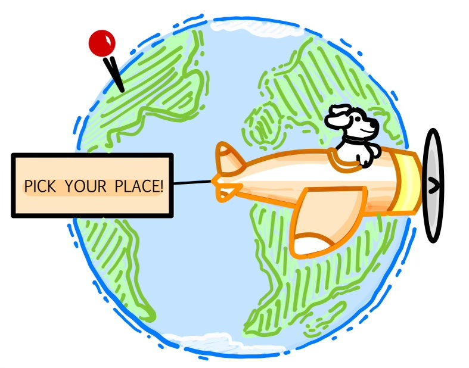

# Pick Your Place
---

## Group Members

- Bella Matasic - bellamatasic
- Jahneulie Weste - jweste25
- Sanya Shrivastava - sanya-shrivastava
- Trinity Bissahoyo - Tbissahoyo
- Nia Maheshwari - pebblefoot31

## Logo

## Description 

This project aims to serve as an informative guide on various countries, and 
will include a supplemental functionality that enables users to consolidate 
a bucket list of locations they are interested in visiting. This application 
can be a convenient alternative to simpler note-taking, list-building, and 
word processing platforms used to compile itineraries. The combined presence
locations and corresponding details in the Traveler’s Bucket List application 
will enable users to learn various aspects about places of their interest 
and make informed touristic decisions.

### Instructions about how to download, install, and run the product

You will need the following softwares:
- Visual Studio Code (see installation instructions [here](https://code.visualstudio.com/))
- Within VS Code, install the Live Browser extension.
- php extension: if you would like to have your bucket list emailed to you:
    1. run the following in a terminal: php -S localhost:8000
    2. go to http://localhost:8000 

**Note: No need to install any extra software besides VS Code***

1. clone repository
2. install live server extension on VS Code
3. navigate to index.html under the 'src' repository
4. right click and choose 'open with live server' 

## Usage Instructions 

1. Navigate to the website's start page.
2. Click 'explore' button. This will bring you to a new page.
3. Click the 'countries' button, and pick a country from the dropdown.
4. click on cities in each country that interest you
5. add touristic spots you want to travel to and add them to your bucket list. You may
    also add the entire city to your bucket list.
6. Click on the 'Pick your place' banner at the top of each page to navigate back to
    countries dropdown button and explore cities in various countries.
7. when you are done, click 'export' to have your bucket list emailed to you!

---

[License information](#LICENSE.txt)
